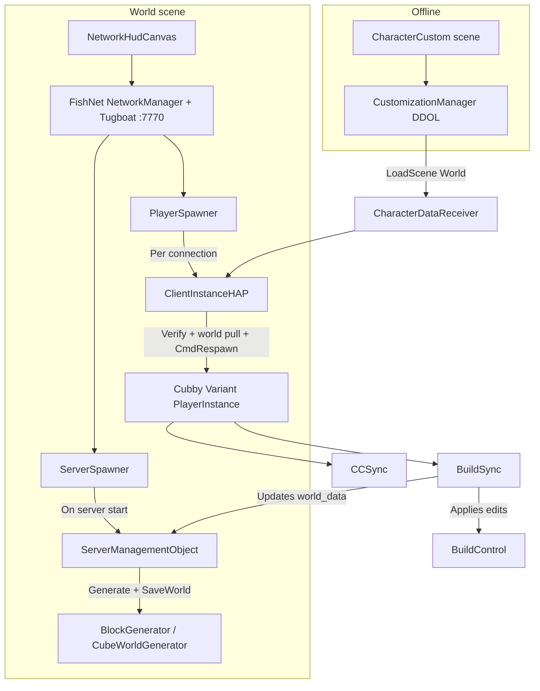
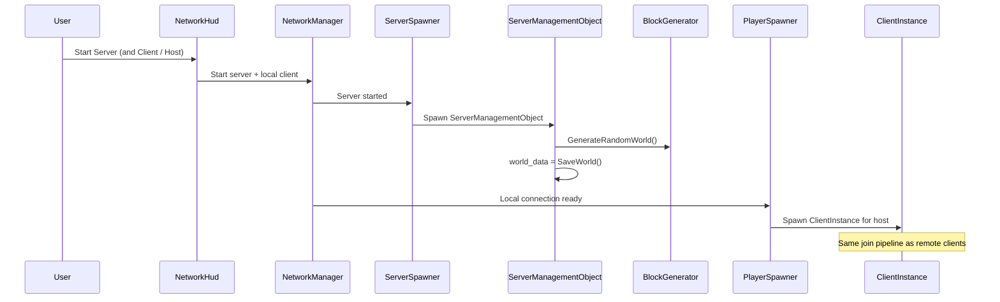
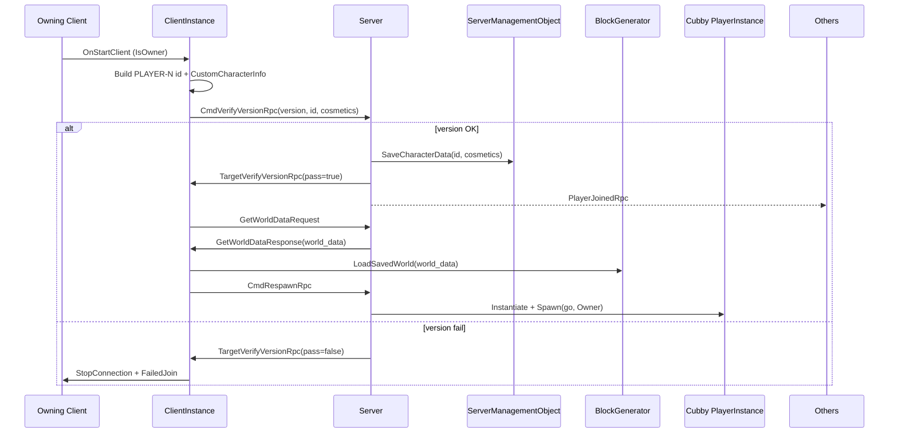
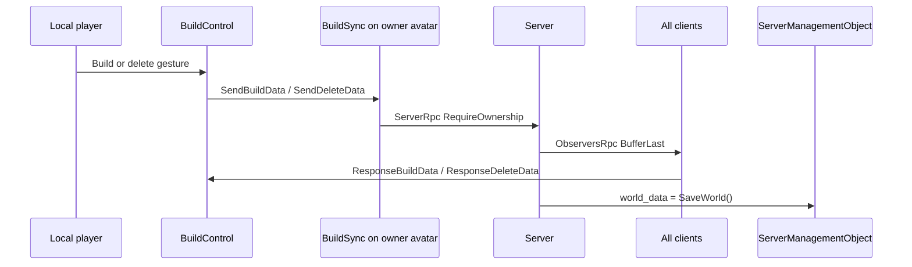

# CubeVerse Multiplayer Workflow Guide

Developer documentation for how multiplayer works in CubeVerse: architecture, join/play flows, key scripts, RPCs, and known limitations.

---

## 1. What CubeVerse Is

CubeVerse is a Unity voxel/sandbox game:

- **ProceduralCubeWorld** (SoftKitty) — terrain generation, build/delete voxels
- **Malbers Animal Controller** — character movement and animation (“Cubby” heroes)
- **FishNet v4** — networking (host/listen-server)
- **Vargr MultiplayerAC / HAP** — Malbers ↔ FishNet bridge (player spawn, ownership, animal sync)

There is **no lobby, room list, or matchmaking**. Players host or join by IP/port using FishNet’s Network HUD.

---

## 2. High-Level Architecture

| Layer | Responsibility |
|--------|----------------|
| **FishNet NetworkManager** | Server/client lifecycle, transport, ticks, spawning |
| **Tugboat** | UDP transport (default port **7770**, address `localhost`) |
| **PlayerSpawner** | Spawns `ClientInstanceHAP` for each connecting client |
| **ServerSpawner** | Spawns `ServerManagementObject` when the server starts |
| **ClientInstance** | Join gate, cosmetics upload, world snapshot download, avatar spawn request |
| **PlayerInstance / AnimalInstance** | Owned avatar; transform/anim/combat sync (Vargr) |
| **CCSync** | Pull and apply character cosmetics for all viewers |
| **BuildSync** | Server-authoritative voxel build/delete |
| **ServerManagementObject** | Server store for cosmetics + canonical `world_data` string |

---

## 3. Scenes and Entry Flow

| Build order (enabled) | Scene | Role |
|----------------------:|-------|------|
| 0 | `Assets/CubeWorld_Assets/Internal_Assets/Scene/CharacterCustom.unity` | Offline cosmetics UI (no FishNet) |
| 1 | `Assets/CubeWorld_Assets/Internal_Assets/Scene/World.unity` | Play world + multiplayer |

`SampleScene` exists in Build Settings but is **disabled**, so World is build index **1**.

### Pre-network flow

1. Player customizes appearance in **CharacterCustom** (`CustomizationManager` / `CustomizationInterface`).
2. Confirm calls `SceneManager.LoadScene(1)` → **World**.
3. `CustomizationManager` persists (DontDestroyOnLoad).
4. In World, `CharacterDataReceiver` copies customization into `CustomCharacterInfo` for the join pipeline.

Multiplayer does **not** start until the player uses the Network HUD in World.

---

## 4. NetworkManager Setup (World scene)

Configured on the NetworkManager in `World.unity`:

| Setting | Value / notes |
|---------|----------------|
| Transport | **Tugboat** |
| Port | **7770** |
| Client address (default) | `localhost` |
| Tick rate | **30** |
| Prediction | **Off** |
| Authenticator | None |
| Remote timeout | 60s |
| HUD auto-start | Disabled — user clicks Server / Client / Host |
| Player spawn prefab | `ClientInstanceHAP` |
| Server spawn prefab | `ServerManagementObject` |
| Spawnables registry | `Assets/DefaultPrefabObjects.asset` |

Define symbols used by the project: `FISHNET`, `FISHNET_V4`, `AC_FISHNET`.

---

## 5. End-to-End Workflows

### 5.1 Host (listen-server)

1. Open **World** scene (after customization).
2. On **NetworkHudCanvas**, start **Server** then **Client**, or **Host**.
3. Tugboat listens on port **7770**.
4. `ServerSpawner` spawns `ServerManagementObject`.
5. On server start, `ServerManagementObject` generates a random world and stores `world_data = BlockGenerator.SaveWorld()`.
6. Host’s connection gets a `ClientInstance`; the join pipeline below runs for the host as well.

### 5.2 Join (remote client)

1. Point Tugboat client address at the host IP (default `localhost`).
2. Click **Client** on the Network HUD.
3. Server’s `PlayerSpawner` spawns a `ClientInstance` owned by that connection.
4. Join pipeline (next section) runs: version check → save cosmetics → load world string → spawn avatar.

### 5.3 Join pipeline (ClientInstance)

This is the core multiplayer handshake. Implemented mainly in:

`Assets/CubeWorld_Assets/External_Assets/Malbers Animations/Integrations/VargrIntegrations/MultiplayerAC/Scripts/Managers/Client/ClientInstance.Fishnet.cs`

**Step detail:**

| Step | What happens |
|------|----------------|
| 1. Name client object | `CLIENT-{ObjectId}` on network start |
| 2. Owner builds player id | `PLAYER-{ObjectId + 1}` |
| 3. Read cosmetics | From `CharacterDataReceiver.instance.CharacterInfo` |
| 4. Version RPC | `CmdVerifyVersionRpc(VERSION_CODE, object_ID, customCharacterInfo)` |
| 5. Server gate | `VERSION_CODE` is currently **0** (always matches) |
| 6. Store cosmetics | `ServerManagementObject.SaveCharacterData` |
| 7. Pass to owner | `TargetVerifyVersionRpc(true)` → rename with `-LOCAL`, set singleton |
| 8. World snapshot | `GetWorldDataRequest` → TargetRpc with `ServerManagementObject.world_data` |
| 9. Load world | `BlockGenerator.LoadSavedWorld(world_data)` |
| 10. Spawn avatar | `TryRespawn` → `CmdRespawnRpc` → `SpawnPlayer()` at `SpawnManager` point → `Spawn(go, Owner)` |

Spawn prefab comes from `ClientInstance`’s character prefab list (project uses **Cubby Variant**).

### 5.4 Play — movement and combat

Handled by Vargr / Malbers networked components on the player prefab:

- **NetworkTransform / NetworkAnimator** — position and animation
- **AnimalInstance** (FishNet partial) — aim, weapons, animator RPCs, SyncVars
- **PlayerInstance** — ownership, local input/UI enablement

Project-owned Internal scripts do **not** implement movement sync; they rely on this integration layer.

### 5.5 Play — cosmetics (CCSync)

When the avatar starts on a client:

1. `CCSync.OnStartClient` → `InitCharacter()`.
2. Derives object id from the GameObject name (strips `-LOCAL`).
3. `RequestCharacterData` (ServerRpc) asks `ServerManagementObject` for that id.
4. `ResponseCharacterData` (TargetRpc) applies meshes/textures (body, hair, hat, etc.).
5. If owner: sets `BlockGenerator.instance.Player = gameObject` so build RPCs know which `BuildSync` to use.

### 5.6 Play — building / deleting voxels (BuildSync)

1. SoftKitty `BuildControl` detects build/delete.
2. Calls `BlockGenerator.instance.Player.GetComponent<BuildSync>().SendBuildData(...)` or `SendDeleteData(...)`.
3. Server validates ownership, applies edit, broadcasts to observers (`BufferLast = true`), refreshes `ServerManagementObject.world_data`.

**World sync model:** full serialized **snapshot** on join + **per-edit RPCs** while playing.

### 5.7 Leave / disconnect

- Stopping client/server via Network HUD tears down FishNet connections.
- Version failure: `ClientManager.StopConnection()` + `FailedJoin()`.
- `ClientInstance.OnDestroy` removes the entry from `ClientDirectory`.
- There is **no** custom reconnect, host migration, or graceful world handoff.

---

## 6. Key Files Map

### Project-owned (Internal)

| Path | Role |
|------|------|
| `Assets/CubeWorld_Assets/Internal_Assets/Scripts/Multiplayer/ServerManagementObject.cs` | Server world generation + cosmetics dictionary + `world_data` |
| `Assets/CubeWorld_Assets/Internal_Assets/Scripts/Multiplayer/CCSync.cs` | Cosmetics request/apply NetworkBehaviour |
| `Assets/CubeWorld_Assets/Internal_Assets/Scripts/Multiplayer/BuildSync.cs` | Voxel build/delete RPCs |
| `Assets/CubeWorld_Assets/Internal_Assets/Prefabs/Multiplayer/ServerManagementObject.prefab` | ServerSpawner target |
| `Assets/CubeWorld_Assets/Internal_Assets/Prefabs/Character/Cubby.prefab` | Networked hero base |
| `Assets/CubeWorld_Assets/Internal_Assets/Prefabs/Character/Cubby Variant.prefab` | Spawned player prefab (CCSync + BuildSync) |
| `Assets/CubeWorld_Assets/Internal_Assets/Scene/World.unity` | Network play scene |
| `Assets/CubeWorld_Assets/Internal_Assets/Scene/CharacterCustom.unity` | Offline cosmetics |
| `Assets/CubeWorld_Assets/Internal_Assets/Scripts/CharacterCustomization/CharacterDataReceiver.cs` | Bridges DDOL cosmetics into World |
| `Assets/CubeWorld_Assets/Internal_Assets/Scripts/Utilities/CustomCharacterInfo.cs` | Serializable cosmetics DTO |
| `Assets/CubeWorld_Assets/Internal_Assets/Scripts/CharacterCustomization/CustomizationInterface.cs` | Confirm → load World |
| `Assets/DefaultPrefabObjects.asset` | FishNet spawnable prefab registry |

### Join / spawn integration (Vargr — customized for CubeVerse)

| Path | Role |
|------|------|
| `.../MultiplayerAC/Scripts/Managers/Client/ClientInstance.cs` | Shared API: version, respawn, spawn points |
| `.../MultiplayerAC/Scripts/Managers/Client/ClientInstance.Fishnet.cs` | **CubeVerse join path** (version, world, spawn) |
| `.../MultiplayerAC/Scripts/Animal/PlayerInstance.cs` | Owned player specialization |
| `.../MultiplayerAC/Scripts/Animal/AnimalInstance.Fishnet.cs` | Avatar SyncVars / combat / anim RPCs |
| `.../MultiplayerAC/Scripts/Managers/Spawn/SpawnManager.cs` | Spawn point selection |
| `.../MultiplayerHAP/Prefabs/ClientInstanceHAP.prefab` | PlayerSpawner connection prefab |

### SoftKitty touchpoints

| Path | Role |
|------|------|
| `.../ProceduralCubeWorld/ExampleScene/Scripts/BuildSystem/BuildControl.cs` | Routes build/delete through `BuildSync` |
| Block / world types under SoftKitty PCW | `BlockGenerator`, world save/load strings |

### FishNet UI used in-product

| Path | Role |
|------|------|
| `Assets/FishNet/Demos/Prefabs/NetworkHudCanvas.prefab` | Host / Client / Server buttons |
| `Assets/FishNet/Demos/Scripts/NetworkHudCanvases.cs` | HUD logic |

---

## 7. RPC and Message Catalog

### Internal (project)

| Kind | Method | Authority / notes |
|------|--------|-------------------|
| ServerRpc | `CCSync.RequestCharacterData(conn, object_ID)` | `RequireOwnership = false` |
| TargetRpc | `CCSync.ResponseCharacterData(conn, CustomCharacterInfo)` | Applies visuals on requesting client |
| ServerRpc | `BuildSync.SendBuildData(...)` | Owner required; updates `world_data` |
| ObserversRpc | `BuildSync.ResponseBuildRequest(...)` | `BufferLast = true`, includes owner |
| ServerRpc | `BuildSync.SendDeleteData(...)` | Owner required; updates `world_data` |
| ObserversRpc | `BuildSync.ResponseDeleteRequest(...)` | `BufferLast = true`, includes owner |

Voxel payloads use SoftKitty `BlockInstance` with FishNet custom serializers (`BlockInstanceRPC`).

### ClientInstance (join path)

| Kind | Method | Purpose |
|------|--------|---------|
| ServerRpc | `CmdVerifyVersionRpc(version, object_ID, customCharacterInfo)` | Gate + store cosmetics |
| ObserversRpc | `PlayerJoinedRpc` | Notify other clients (`ExcludeOwner`) |
| TargetRpc | `TargetVerifyVersionRpc(pass)` | Accept/reject joiner |
| ServerRpc | `GetWorldDataRequest(conn)` | Ask for world string |
| TargetRpc | `GetWorldDataResponse(conn, world_data)` | Deliver snapshot |
| ServerRpc | `CmdRespawnRpc` | Server spawns owned avatar |

### AnimalInstance (Vargr — on avatar)

Owner-auth SyncVars and RPCs for aim direction, attack charge, active weapon, holster, projectiles, animator parameters, mode/state triggers. See `AnimalInstance.Fishnet.cs` for the full list. Not part of the voxel loop, but present on the networked player.

---

## 8. Design Patterns and Conventions

1. **Listen-server / host model** — one player runs server+client; others connect as clients. No dedicated lobby service.
2. **Two-stage spawn** — `ClientInstance` (connection object) first, then owned `PlayerInstance` avatar.
3. **Server authority for world edits** — clients propose builds via ServerRpc; server broadcasts and refreshes the save string.
4. **Snapshot + delta** — joiners get full `world_data`; live players get incremental build/delete RPCs.
5. **Cosmetics by id** — server dictionary keyed by `"PLAYER-N"`; clients pull via TargetRpc after spawn (not live SyncVars).
6. **Conditional compilation** — Vargr uses `#if AC_FISHNET` / `#if AC_PURRNET`; CubeVerse ships with FishNet.
7. **Fragile name lookups** — several scripts use `GameObject.Find("ServerManagementObject(Clone)")`, `"CubeWorldGenerator"`, `"PlayerCamera"`. Renaming those objects breaks multiplayer.

---

## 9. Local Dev Quick Start

1. Enter Play Mode from **CharacterCustom** (or load it first), customize, confirm → World.
2. On Network HUD:
   - **Host alone:** Server + Client (or Host).
   - **Two editors / builds:** Host on machine A; Client on machine B with A’s IP and port **7770**.
3. Confirm firewall allows UDP **7770**.
4. Both clients should load the same voxel world and see each other’s Cubby after spawn.

---

## 10. Known Gaps and Pitfalls

| Topic | Detail |
|-------|--------|
| No lobby / matchmaking | Direct IP:port only |
| `VERSION_CODE = 0` | Version check always passes until you raise it on all builds |
| `CharacterDictionary.Add` | Duplicate keys throw; disconnect/rejoin with same id can fail |
| Missing cosmetics key | `GetCharacterData` throws if id not found |
| Cosmetics not live-synced | Appearance applied once after request; no SyncVar updates mid-session |
| No client-side prediction | Movement/build feel latency at higher ping |
| Disconnect cleanup | Minimal; no world ownership transfer or reconnect |
| Host world generation | New random world each server start; late joiners get current `world_data` (includes builds if refreshed) |
| BuildSync host path | Server also calls local `PlayerCamera` `BuildControl` while ObserversRpc runs — watch for double-apply on host |
| FishNet SceneManager | Not used; scene flow is Unity `LoadScene` + World-resident NetworkManager |
| Vendor surface area | MultiplayerAC has many unused sync utilities relative to the voxel loop |

---

## 11. Where to Change Things Safely

| Goal | Start here |
|------|------------|
| Change default port / address | Tugboat on NetworkManager in `World.unity` |
| Change spawned hero | `ClientInstance` character prefabs / Cubby Variant |
| Change join order or world pull | `ClientInstance.Fishnet.cs` |
| Change cosmetics sync | `CCSync.cs` + `ServerManagementObject` dictionary |
| Change build networking | `BuildSync.cs` + `BuildControl.Send*` |
| Change world generation on host | `ServerManagementObject.RunAfterServerInitialized` |
| Add real versioning | Raise `VERSION_CODE` in `ClientInstance.cs` and ship matching builds |
| Add lobby / rooms | New system on top of FishNet — none exists today |

---

## 12. Mental Model (one paragraph)

CubeVerse multiplayer is a **thin FishNet layer**: customize offline → enter World → host or join via Network HUD → `ClientInstance` uploads cosmetics and downloads the voxel world string → server spawns an owned Cubby → `CCSync` paints appearance and `BuildSync` keeps builds in sync while Malbers/Vargr handle movement. If you understand that pipeline, you understand the product multiplayer path; everything else is either FishNet infrastructure or Malbers integration detail.
